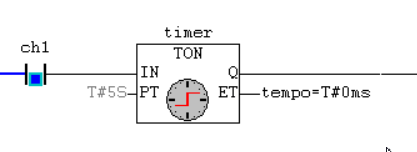
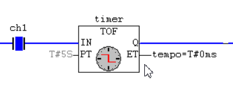
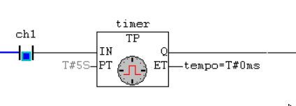
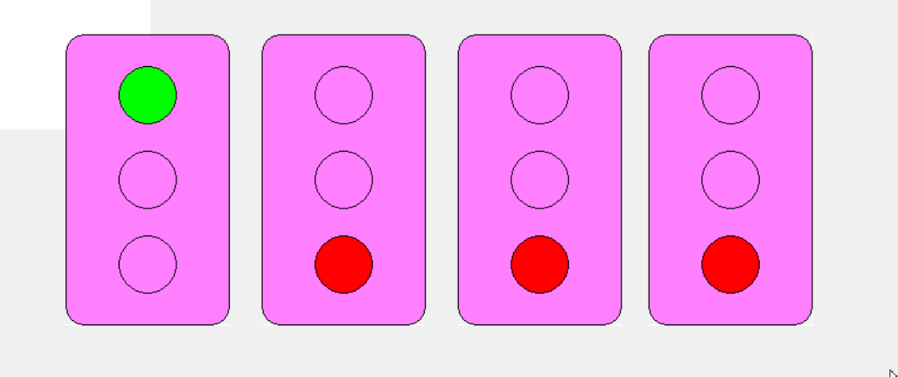

**Professor:** Maicon Bandeira
**Tags:** `ladder` `CLP` `portas-lógicas` `timers` `contadores`

---

## Portas Lógicas no MasterTools

### Porta AND


| CH1 | CH2 | Saída |
| --- | --- | ----- |
| 0   | 0   | 0     |
| 0   | 1   | 0     |
| 1   | 0   | 0     |
| 1   | 1   | 1     |

### Porta OR


| CH1 | CH2 | Saída |
| --- | --- | ----- |
| 0   | 0   | 0     |
| 0   | 1   | 1     |
| 1   | 0   | 1     |
| 1   | 1   | 1     |

### Porta NOR


| CH1 | CH2 | Saída |
| --- | --- | ----- |
| 0   | 0   | 1     |
| 0   | 1   | 0     |
| 1   | 0   | 0     |
| 1   | 1   | 0     |

### Porta NAND


| CH1 | CH2 | Saída |
| --- | --- | ----- |
| 0   | 0   | 1     |
| 0   | 1   | 1     |
| 1   | 0   | 1     |
| 1   | 1   | 0     |

### Porta XOR


| CH1 | CH2 | Saída |
| --- | --- | ----- |
| 0   | 0   | 0     |
| 0   | 1   | 1     |
| 1   | 0   | 1     |
| 1   | 1   | 0     |

### Porta XNOR


| CH1 | CH2 | Saída |
| --- | --- | ----- |
| 0   | 0   | 1     |
| 0   | 1   | 0     |
| 1   | 0   | 0     |
| 1   | 1   | 1     |

---
## Timers em Ladder

### Timer Delay On (TON)

Timer que **espera** um tempo antes de elevar a saída `Q` ao nível alto.



- **`IN`:** Pulso que inicia o timer.
- **`PT`:** Tempo de preset — formato `T#5S`.
- **`ET`:** Variável de tempo interno (elapsed time).
- **`Q`:** Saída lógica — vai a nível alto após `PT`.

### Timer Delay Off (TOF)

Timer que **espera** um tempo antes de abaixar a saída `Q`.



- **`IN`:** Pulso que inicia o timer.
- **`PT`:** Tempo de preset — formato `T#5S`.
- **`ET`:** Variável de tempo interno.
- **`Q`:** Saída lógica — vai a nível baixo após `PT`.

### Timer Pulse (TP)

Timer que gera um **pulso de duração fixa** `PT` a partir de um sinal em `IN`.



- **`IN`:** Pulso que inicia o timer.
- **`PT`:** Duração do pulso — formato `T#5S`.
- **`ET`:** Variável de tempo interno.
- **`Q`:** Saída lógica — fica ativa pelo tempo definido em `PT`.

---
## Contadores em Ladder

### Contador UP (CTU)


- **`CU`:** Pulso de incremento do contador.
- **`RESET`:** Zera `CV`.
- **`PV`:** Valor limite (threshold) — quando `CV >= PV`, `Q = 1`.
- **`CV`:** Contagem interna.
- **`Q`:** Saída lógica.

### Contador DOWN (CTD)


- **`CD`:** Pulso de decremento do contador.
- **`LOAD`:** Carrega o valor de `PV` em `CV`.
- **`PV`:** Valor inicial (tipo `INT`).
- **`CV`:** Contagem interna.
- **`Q`:** Saída lógica — nível alto quando `CV = 0`.

### Contador UP/DOWN (CTUD)


- **`CU`:** Pulso de incremento.
- **`CD`:** Pulso de decremento.
- **`RESET`:** Zera `CV`.
- **`LOAD`:** Carrega o valor de `PV` em `CV`.
- **`PV`:** Valor de referência (tipo `INT`).
- **`CV`:** Contagem interna.
- **`QU`:** Saída incremental — nível alto quando `CV >= PV`.
- **`QD`:** Saída decremental — nível alto quando `CV = 0`.

___ 
### Exercícios


### A)


### B)


---
## Ligação com o CLP

A declaração de variáveis abaixo indica uma ligação com o **CLP**. A estrutura **`AT %IX0.3`** representa uma entrada (Input) no endereço `0.3`, onde `AT` significa atribuição e `%IX` indica entrada digital. A saída é indicada por `%QX1.4`, onde `Q` significa saída no endereço `1.4`.


> **Lembrete:** Utilizar `Baudrate = 115200` no CLP Altus.

---
## Semáforo 2 Tempos

Implementação de semáforo com dois estados temporizados em Ladder.


---
## Visualizações

Implementação de semáforo com quatro estados temporizados em Ladder.




---

## Gatilhos de borda

os **gatilhos de borda** (*edge triggers*) detectam transições de sinal — de baixo para alto ou de alto para baixo — gerando um pulso de duração de um ciclo de scan. São usados quando se deseja reagir ao momento exato da mudança de estado, e não ao nível do sinal.

### R_TRIG — Rising Edge Trigger

Detecta a **borda de subida**: gera um pulso em `Q` no ciclo em que `CLK` transita de `0` para `1`.


- **`CLK`:** Sinal de entrada monitorado.
- **`Q`:** Saída — nível alto por exatamente um ciclo de scan na borda de subida de `CLK`.
  
### F_TRIG — Falling Edge Trigger

Detecta a **borda de descida**: gera um pulso em `Q` no ciclo em que `CLK` transita de `1` para `0`.


- **`CLK`:** Sinal de entrada monitorado.
- **`Q`:** Saída — nível alto por exatamente um ciclo de scan na borda de descida de `CLK`.

---

## Blocos Aritméticos

Os **blocos aritméticos** realizam operações matemáticas sobre variáveis do tipo numérico (`INT`, `REAL` etc.) dentro do programa Ladder. Cada bloco recebe duas entradas (`IN1` e `IN2`) e produz um resultado em `OUT`.


| Bloco     | Operação        | Resultado (`OUT`)         |
| ------- | --------------- | ------------------------- |
| `   DD`   | Adição          | `IN1 + IN2`               |
|   `SUB`   | Subtração       | `IN1 - IN2`               |   | `MUL`   | Multiplicação   | `IN1 × IN2`         `DIV`   |
| `DIV`   | Divisão         | `IN1 ÷ IN2`               |

> **Lembrete:** Para `DIV`, garantir que `IN2 ≠ 0` para evitar erro de execução no CLP.

---  
## Blocos Trigonométricos

Os **blocos trigonométricos** operam sobre valores do tipo `REAL` (ponto flutuante). Os ângulos são fornecidos em **radianos**.


  


  

  


| Bloco  | Operação       | Entrada     | Saída (`OUT`)       |
| ------ | -------------- | ----------- | ------------------- |
| `SIN`  | Seno           | Radianos    | $\sin(\text{IN})$   |
| `COS`  | Cosseno        | Radianos    | $\cos(\text{IN})$   |
| `TAN`  | Tangente       | Radianos    | $\tan(\text{IN})$   |
| `ASIN` | Arco seno      | $[-1, 1]$   | Radianos            |
| `ACOS` | Arco cosseno   | $[-1, 1]$   | Radianos            |
  
---
## Comparadores Lógicos

Os **comparadores lógicos** comparam dois valores numéricos e ativam a saída quando a condição é satisfeita. São habilitados pela entrada `EN` e retornam o resultado em `ENO`.


| Bloco  | Condição verificada   | Saída ativa quando…   |
| ------ | --------------------- | --------------------- |
| `EQ`   | Igual                 | `IN1 = IN2`           |
| `NE`   | Diferente             | `IN1 ≠ IN2`           |
| `LT`   | Menor que             | `IN1 < IN2`           |
| `LE`   | Menor ou igual a      | `IN1 ≤ IN2`           |
| `GT`   | Maior que             | `IN1 > IN2`           |
| `GE`   | Maior ou igual a      | `IN1 ≥ IN2`           |
  
---
## Declaração de Variáveis Constantes com Valor Inicial

No MasterTools, variáveis podem ser declaradas com um **valor inicial fixo**, garantindo que o programa parta de um estado conhecido a cada inicialização do CLP.


A sintaxe segue o padrão:

```
NomeVariavel : Tipo := ValorInicial;
```

- **`NomeVariavel`:** Identificador da variável, sem espaços ou acentos.
- **`Tipo`:** Tipo de dado — ex: `INT`, `REAL`, `BOOL`, `TIME`.
- **`:=`:** Operador de atribuição de valor inicial.
- **`ValorInicial`:** Valor com o qual a variável é carregada na inicialização — ex: `0`, `3.14`, `TRUE`, `T#5S`.

---
## Bobinas Set-Reset

As **bobinas Set-Reset** (`S`/`R`) são elementos de memória em Ladder que mantêm seu estado mesmo após a condição que as ativou deixar de ser verdadeira — ao contrário de bobinas convencionais, que seguem diretamente o estado do contato.

### Bobina Set (S)

Quando a condição de entrada é verdadeira (`1`), a variável associada é **setada** (vai a nível alto) e **permanece assim** mesmo que a condição volte a ser falsa.


### Bobina Reset (R)

Quando a condição de entrada é verdadeira (`1`), a variável associada é **resetada** (vai a nível baixo) e **permanece assim** até que uma bobina `S` a acione novamente.

  

| Instrução | Condição verdadeira  | Condição falsa         |
| --------- | -------------------- | ---------------------- |
| `S`       | Variável → `1`       | Variável mantém `1`    |
| `R`       | Variável → `0`       | Variável mantém `0`    |

O par `S`/`R` forma um **flip-flop SR** em Ladder, sendo amplamente utilizado em lógicas de partida/parada de motores e controle de estados com memória.  

> **Lembrete:** Quando `S` e `R` são acionados simultaneamente, o comportamento depende da implementação do CLP — no MasterTools, a instrução que aparece **por último no scan** tem prioridade (geralmente `R`).